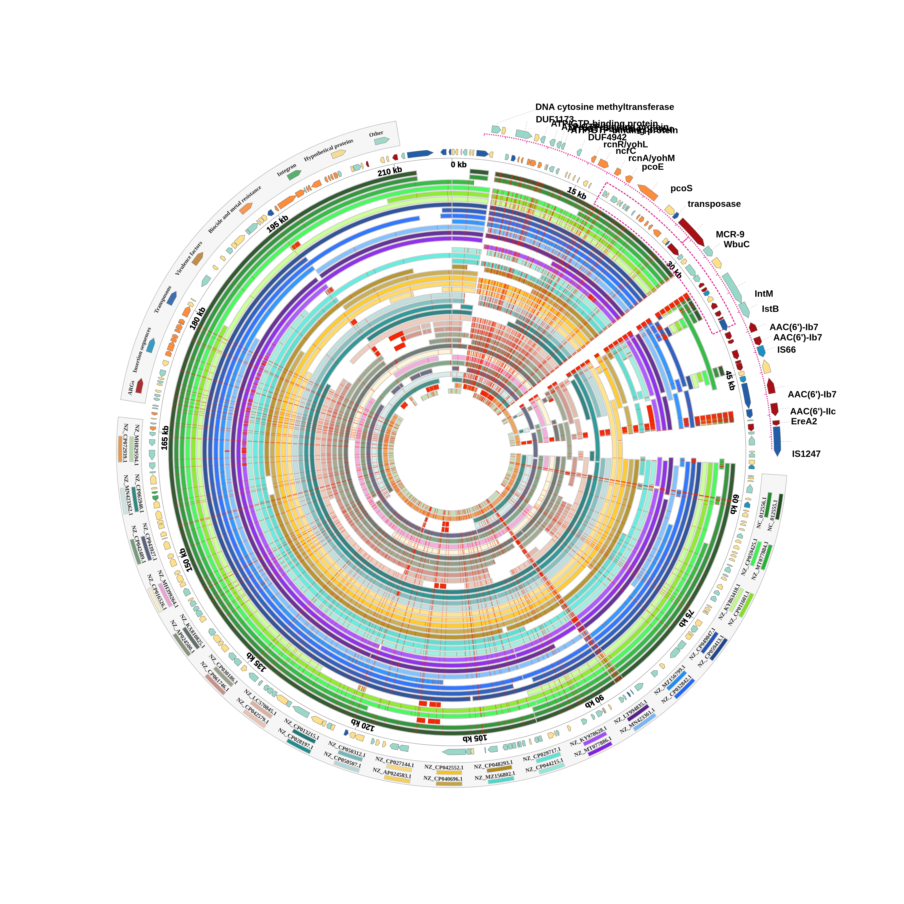

# Plasmid Mapper

A D3.js tool for visualizing and comparing circular plasmids as publication-ready
figures. It renders a reference plasmid as a circular map annotated with ORFs
(resistance genes, insertion sequences, transposons, virulence factors, etc.)
and overlays BLAST comparison rings against a set of related sequences —
similar in spirit to tools like BRIG or Proksee's ring viewer.

## Contents

- `mapper.html` — the circular plasmid/BLAST-ring viewer (main tool).
- `index.html`, `html/aln.html` — a separate linear alignment browser (not covered here yet).
- `js/pl_mapper.js` — core D3 rendering logic for `mapper.html` (rings, ORF arrows,
  legends, axis ticks, PNG/TIFF export).
- `js/ref_data.js` — reference plasmid definitions and BLAST hit data consumed by
  `mapper.html` (`Contig_ref`, `MAP_DATA`, `MCR_LOC`).
- `js/inline_style.js` — color palettes for ORF categories and BLAST hit rings.
- `js/FileSaver.js` — client-side file saving (used for image export).
- `js/data.js`, `js/pl_data.js` — large embedded datasets used by `index.html` /
  `html/aln.html` (not used by `mapper.html`).
- `js/mustache.js`, `js/templates.js` — templating used by `index.html` /
  `html/aln.html` popovers.
- `css/style.css` — shared styling.
- `examples/` — sample rendered outputs.

## Usage

Open `mapper.html` in a browser (or serve the directory with any static file
server). Select a query plasmid from the dropdown, choose which BLAST subject
hits to display as rings, and click **Save png** to export a high-resolution
raster image sized by the width/height fields.

## Status

This is v0: the working tool as it existed locally, brought under proper
version control. Next steps involve building a generic/repeatable data
generation pipeline (e.g. for KPC-33 plasmid comparisons) to replace manual
editing of `js/ref_data.js`.
